# KG Pipeline — Level 1 (overview)

The 30,000-foot view: raw chat goes in, the live knowledge graph comes
out. Each stage is one worker reading from its input bucket and writing
to its output bucket. Buckets (cylinder shapes) ARE the queues — there's
no implicit coordination, no shared state.

Click any stage box (in a Mermaid-aware viewer) to drill into that
stage's internals.

```mermaid
flowchart TD
    UL[("unified_log_2026<br/>raw chat + assistant turns<br/>(immutable source of truth)")]:::source

    UL --> S1["<b>Stage 1: Resolve entities</b><br/>entity_resolver agent<br/>(per day, batched)"]
    S1 --> RM[("kg_resolved_message<br/>'I' → '(Alex)', 'she' → '(Jamie)'")]

    RM --> S2["<b>Stage 2: Segment</b><br/>conversation_boundary agent<br/>(coherent topic windows)"]
    S2 --> WIN[("kg_window<br/>+ kg_window_message")]

    WIN --> S3["<b>Stage 3: Critique + Extract</b><br/>window_critic agent<br/>+ fact_extractor agent"]
    S3 --> EXT[("kg_window_extraction<br/>verdict + nodes/edges JSON")]

    EXT --> S35["<b>Stage 3.5: Enrich</b><br/>meta_data_add agent<br/>(per connected component)"]
    S35 --> ENR[("kg_window_enrichment<br/>1 row per component<br/>= 1 future proposal")]

    ENR --> S4["<b>Stage 4: Write proposals</b><br/>deterministic DB writes<br/>(no LLM)"]
    S4 --> CP[("claim_proposal<br/>+ proposal_node/edge/evidence<br/>(the 'shadow KG')")]

    CP --> S5["<b>Stage 5: Promote</b><br/>proposal_promoter routine<br/>+ TTL estimator<br/>+ fact canonicalizer"]
    S5 --> KG[("<b>Live KG</b><br/>kg_node_metadata<br/>kg_edge_metadata")]:::live

    KG -.->|TTLs expire| DEC["Decay routine<br/>(nightly maintenance)<br/>step_state_decay.py"]
    DEC -.->|close stale eras| KG

    click S1 "01_stage_resolve.md" "Stage 1 internals"
    click S2 "02_stage_segment.md" "Stage 2 internals"
    click S3 "03_stage_critic_extract.md" "Stage 3 internals"
    click S35 "04_stage_enrich.md" "Stage 3.5 internals"
    click S4 "05_stage_proposals.md" "Stage 4 internals"
    click S5 "06_stage_promote.md" "Stage 5 internals"
    click DEC "07_decay_routine.md" "Decay routine"

    classDef source fill:#fef3c7,stroke:#92400e,color:#000
    classDef live fill:#dcfce7,stroke:#15803d,color:#000
```

## Reading the diagram

- **Yellow box** = the immutable source. Nothing in the pipeline ever
  modifies `unified_log_2026.message`; that's the audit trail.
- **Cylinders** = queue tables. Each is the output of the stage above
  it AND the input of the stage below it.
- **Square boxes** = workers (one daemon thread each). Five run inside
  `KGPipeline` (Stages 1–4); Stage 5 is its own scheduled routine.
- **Green box** = the live KG, the only writers to which are Stage 5
  (creates) and the decay routine (closes).
- **Dashed lines** = the maintenance loop, separate from the ingest
  flow.

## What's NOT shown at this level

These live in level-2 drill-downs (linked from the boxes above):

- The **chat-eligibility filter** baked into Stage 1's input query
  (which `source` / `role` / `room_id` values qualify).
- **Cross-window links** (the "A B A" topic-resumption pattern) emitted
  by Stage 2.
- The **critic-vs-extractor short-circuit** in Stage 3 (rejected
  windows skip the extractor).
- **Connected-component splitting** in Stage 3.5 (deterministic graph
  algorithm before the LLM enrichment call).
- The **promotion logic** in Stage 5 — entity resolution, edge dedup,
  TTL assignment, sentence canonicalization, the per-table evidence
  rows.
- **Manual review** at the `/kg-proposals/` admin UI (sits between
  Stage 4 and Stage 5 when a human wants to vet proposals).
- The **maintenance pipeline** parallel to this one: `kg_maintenance_pipeline`
  produces `kg_maintenance_finding` rows from a healthy KG (duplicates,
  missing dates, wiki contradictions) which feed the investigator +
  resolution manager (their own diagrams, separate from this pipeline).

## Sister diagrams (planned)

- Maintenance loop: `kg_maintenance_finding` lifecycle (pending →
  investigated → executed/dismissed/escalated).
- Importance rating: how `me::importance_rater` and
  `me::edge_importance_rater` produce the scores consumers blend.
- Pod store: how non-KG content (images, emails, chat clusters) lands
  as pods, and which pods get mirrored into the KG.

These run alongside the ingest pipeline and share many components
(scope contracts, agent factory, DI), but they're separate flows worth
their own overviews.
